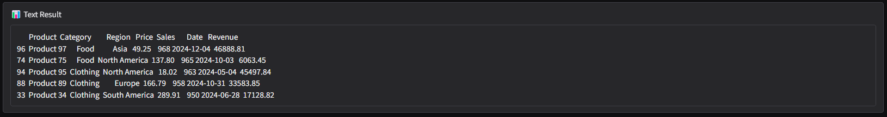
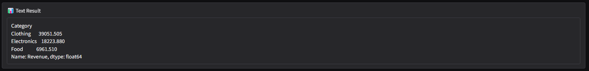
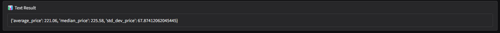
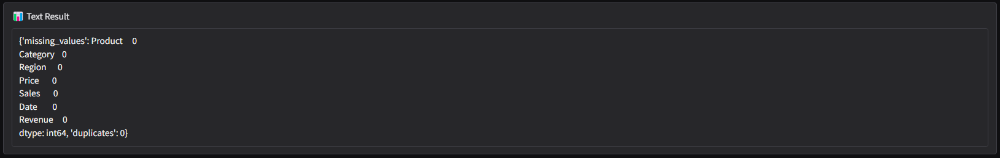
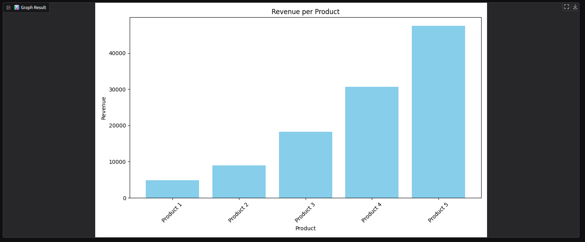

# Data Analysis Agent

## Overview
This repository provides a data analysis agent that allows users to upload CSV files and query insights using natural language. The agent utilizes OpenAI GPT-3.5-Turbo to analyze and visualize the data.

## Features
- Upload CSV files for analysis.
- Query the dataset in natural language.
- Receive textual and graphical outputs.
- Supports various types of visualizations including bar charts, scatter plots, and histograms.
- Built using OpenAI API, Pandas, Matplotlib, and Gradio.

## Installation
To run this project, install the required dependencies using the following command:
```sh
pip install -r requirements.txt
```

## Usage
1. Clone the repository:
   ```sh
   git clone https://github.com/dhruv-gautam16/Data_Analysis_Agent.git
   ```
2. Navigate to the project directory:
   ```sh
   cd Data_Analysis_Agent
   ```
3. Install dependencies:
   ```sh
   pip install -r requirements.txt
   ```
4. Run the application:
   ```sh
   python app.py
   ```
5. Open the Gradio interface in your browser and start analyzing data!

## Sample Queries and Results
Below are sample queries along with their respective results. The results are stored as images in the `images/` folder.

### 1. What are the top 5 products with the highest sales?


### 2. Show me the average revenue per category.


### 3. Show the average, median, and standard deviation of the ‘Price’ column.


### 4. Identify issues like invalid values, missing data, or duplicates and suggest resolutions.


### 5. Show a bar chart of revenue per product.


## Contributing
Contributions are welcome! Feel free to fork the repository and submit a pull request.

## License
This project is licensed under the MIT License.

